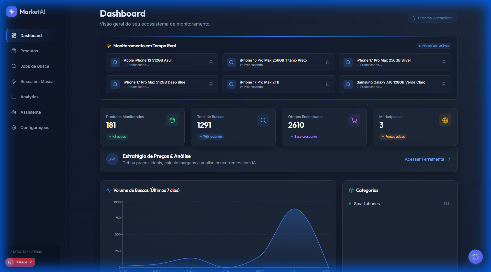
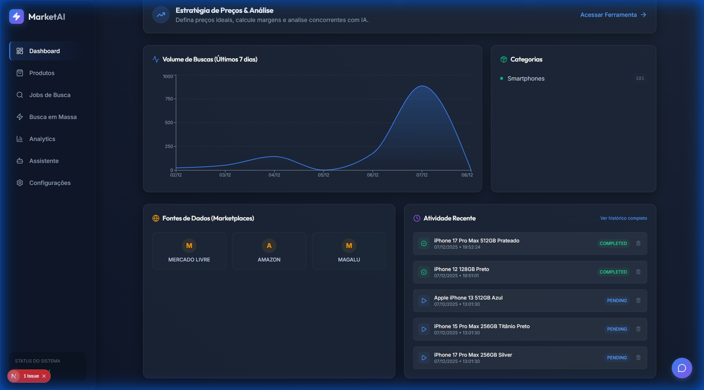
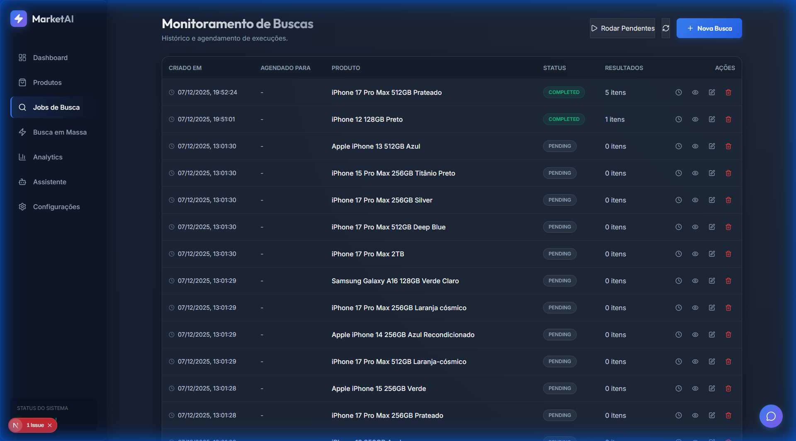
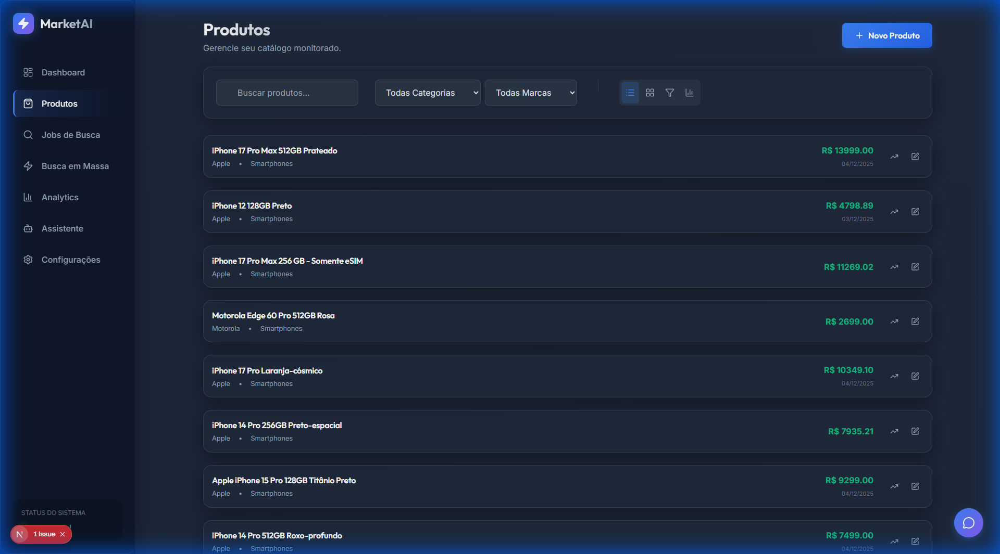
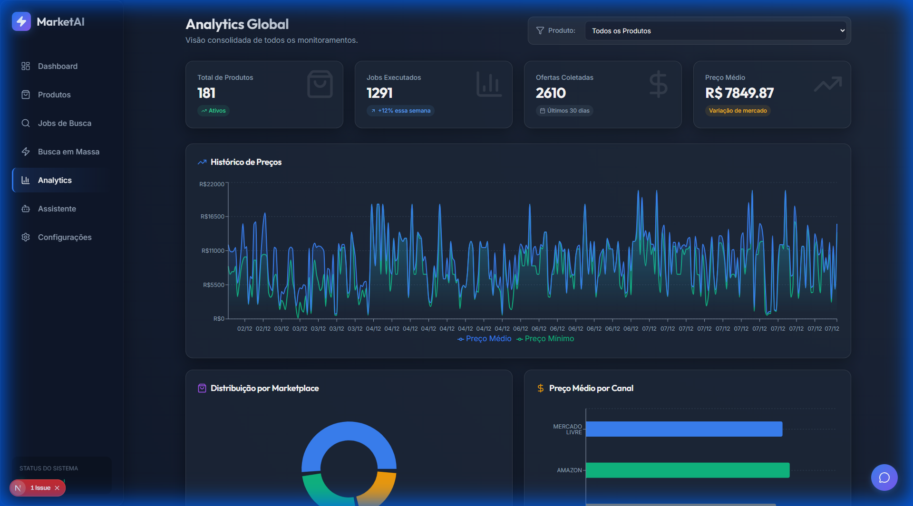
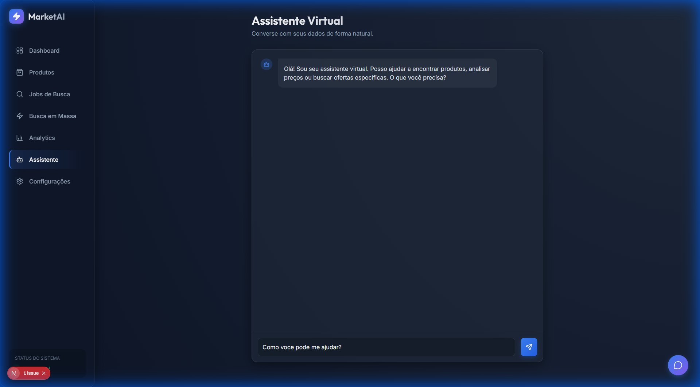

# MarketAI - Demonstração da Aplicação

Este documento apresenta um tour visual pelas principais funcionalidades da plataforma **MarketAI**.

## 1. Dashboard Principal
A tela inicial oferece uma visão geral rápida do sistema.

## 2. Métricas em Tempo Real
Ao rolar a página, o usuário tem acesso a estatísticas consolidadas sobre jobs, produtos e lojas monitoradas.

## 3. Gerenciamento de Jobs
A seção de **Jobs** permite criar, visualizar e gerenciar tarefas de coleta de dados (scraping).

## 4. Catálogo de Produtos
Em **Produtos**, é possível visualizar todos os itens coletados, com detalhes de preço, loja e disponibilidade.

## 5. Analytics
A área de **Analytics** fornece gráficos e insights visuais sobre a distribuição de preços e tendências de mercado.

## 6. Assistente Inteligente
O **Assistente AI** permite interagir com os dados usando linguagem natural, fazendo perguntas sobre o mercado.

